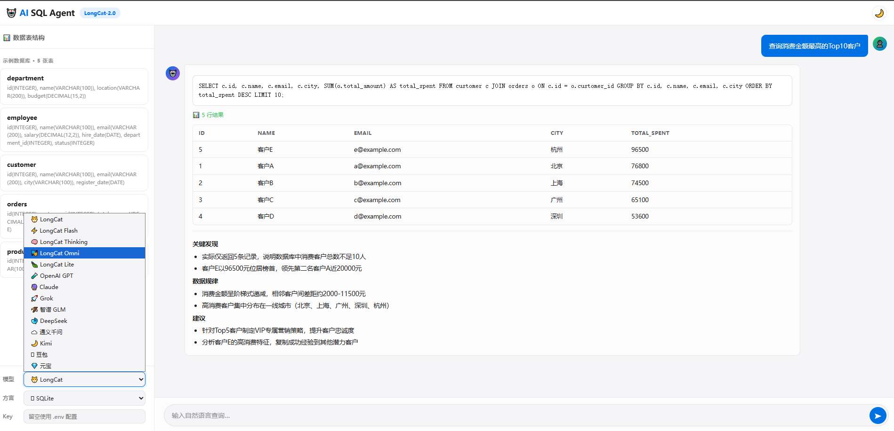

<p align="center">
  <h1 align="center">🤖 AI SQL Agent</h1>
  <p align="center">
    <strong>基于多模型协同的 AI SQL 智能体</strong>
  </p>
  <p align="center">
    🚀 自然语言 → SQL 生成 → 执行 → 结果分析，一站式智能数据查询
  </p>
  <p align="center">
    <a href="https://github.com/SongdDuo/AI-SQL-Agent" target="_blank">🌟 GitHub</a> •
    <a href="https://github.com/SongdDuo/AI-SQL-Agent/actions" target="_blank">🔄 Actions</a> •
    <a href="#核心痛点">💡 痛点</a> •
    <a href="#核心架构">🏗️ 架构</a> •
    <a href="#功能特性">✨ 功能</a> •
    <a href="#快速开始">🚀 快速开始</a> •
    <a href="#使用方式">📖 使用</a> •
    <a href="#支持的模型">🧠 模型</a> •
    <a href="#项目架构">📁 项目结构</a> •
    <a href="#贡献指南">🤝 贡献</a> •
    <a href="README_EN.md">English</a>
  </p>
</p>

---

## 💡 核心痛点

在实际业务中，数据查询严重依赖开发人员手写 SQL，非技术人员无法直接进行数据分析，导致沟通成本高、响应慢。

**AI SQL Agent** 旨在解决这一问题：让用户用自然语言描述需求，系统自动完成 SQL 生成、执行、结果分析的完整闭环。

## 🏗️ 核心架构

该系统采用 **Agent + Tool Calling** 设计，整体流程如下：

```
┌──────────┐     ┌──────────┐     ┌──────────┐     ┌──────────┐     ┌──────────┐
│  用户输入  │────▶│  语义解析  │────▶│  SQL 生成  │────▶│  SQL 校验  │────▶│  SQL 执行  │
│ (自然语言) │     │ (Agent)   │     │ (LLM+CoT) │     │ (Validator)│     │ (DB)      │
└──────────┘     └──────────┘     └──────────┘     └──────────┘     └──────────┘
                       │                │                │                │
                       │                │         ┌──────┴──────┐         │
                       │                │         │  自动修复    │         │
                       │                │         │ (Auto-Fix)  │◀────────┘
                       │                │         └──────┬──────┘ (执行失败时)
                       │                │                │
                       ▼                ▼                ▼                ▼
                  ┌─────────────────────────────────────────────────────────────┐
                  │                     结果分析 & 综合报告                       │
                  │              (多轮上下文 + Schema 感知推理)                    │
                  └─────────────────────────────────────────────────────────────┘
```

## 📊 实际效果

### 🌐 Web UI 界面

AI SQL Agent 提供了基于浏览器的 Web UI，内置示例数据库，支持自然语言查询、SQL 生成、结果展示和 AI 分析，无需配置即可体验完整流程。

<p align="center">
  
</p>

> 启动命令：`ai-sql web --port 8080`，然后打开浏览器访问 `http://127.0.0.1:8080`

### 📈 效果数据

- ⚡ **数据查询效率提升约 60%~80%**
- 👥 **非技术用户可直接完成基础分析任务**
- ✅ **在测试场景中，大部分常见分析问题可自动生成正确 SQL**
- 🔧 **SQL 执行失败自动修复，减少人工干预**
- 💬 **多轮对话支持，连续提问无需重复上下文**

### 🔄 Tool Calling 循环

1. 📝 用户输入自然语言问题（如"近30天订单趋势"）
2. 🧠 Agent 解析语义并结合数据库 schema 进行字段映射
3. 💻 自动生成 SQL，并进行语法与逻辑校验
4. 🔧 若 SQL 执行失败 → 自动修复并重试
5. 🗄️ 调用数据库执行查询
6. 📊 对查询结果进行自然语言总结输出

### 🧠 推理方式

- **链式推理（CoT）**：Agent 先思考再行动，逐步拆解复杂任务
- **SQL 校验循环**：生成 → 校验 → 修复 → 重试，确保 SQL 正确性
- **Schema 感知**：连接数据库后自动理解表结构，生成精准 SQL
- **多轮上下文**：支持连续提问，维护对话历史

## ✨ 功能特性

- 💬 **自然语言转 SQL** — 用中文描述需求，自动生成生产级 SQL
- 🤖 **Agent 自动工作流** — 任务自动拆解 → SQL 生成 → 执行 → 结果分析
- 🚀 **SQL 执行引擎** — 连接真实数据库，直接执行并返回结构化结果
- 📊 **智能结果分析** — AI 自动解读查询结果，发现数据规律和异常
- ⚡ **SQL 优化建议** — 检测性能问题，给出优化方案和索引建议
- 📝 **SQL 解释** — 将复杂 SQL 逐步拆解为自然语言说明
- 🔧 **SQL 自动修复** — 执行失败时自动诊断并修复 SQL 错误
- 🧠 **多模型支持** — LongCat / GPT / GLM / Claude / MiMo / DeepSeek / Qwen
- 🗄️ **多方言支持** — 达梦(DM)、MySQL、PostgreSQL、SQLite
- 🕵️ **Schema 感知** — 连接数据库后，AI 自动理解表结构生成精准 SQL
- 💬 **多轮对话** — 支持连续提问，维护上下文理解
- 🛠️ **CLI & SDK** — 命令行工具 + Python SDK，灵活集成

## 🚀 快速开始

### 安装

```bash
pip install ai-sql-agent
```

按需安装数据库驱动：

```bash
pip install ai-sql-agent[dm]       # 达梦
pip install ai-sql-agent[mysql]    # MySQL
pip install ai-sql-agent[postgres] # PostgreSQL
pip install ai-sql-agent[claude]   # Claude 支持
pip install ai-sql-agent[all]      # 全部
```

### 测试配置

创建 `.env` 文件进行本地测试：

```bash
# 选择默认模型提供商（推荐使用 LongCat）
AI_DEFAULT_PROVIDER=longcat

# 配置 API Key
AI_LONGCAT_API_KEY=your_longcat_api_key_here

# 测试时使用 SQLite（无需真实数据库）
DB_TYPE=sqlite
DB_NAME=:memory:  # 内存数据库，测试完即销毁
```

### 样式说明

本项目使用 **Rich** 库提供优雅的 CLI 输出：

- 🟦 **SQL 代码块**：语法高亮，行号显示
- 🟨 **解释面板**：Markdown 格式的自然语言解释
- 🟩 **优化建议**：绿色背景的优化后 SQL
- 🟥 **错误提示**：红色背景的错误信息
- 📊 **表格展示**：子任务列表使用表格布局
- 🎨 **颜色主题**：Monokai 主题的 SQL 语法高亮

## 📖 使用方式

### CLI 命令行

```bash
# 自然语言转 SQL
ai-sql ask "查询每个部门的平均工资，只显示大于10000的"

# 指定达梦方言
ai-sql -d dm ask "最近30天新增用户按天统计"

# 使用 LongCat 模型
ai-sql -p longcat ask "查询销售额Top10的客户"

# 使用 LongCat Thinking 模型（更强推理能力）
ai-sql -p longcat-thinking ask "分析近半年销售趋势并预测下月"

# 解释 SQL
ai-sql explain "SELECT * FROM orders WHERE status = 1"

# 优化 SQL
ai-sql optimize "SELECT * FROM orders WHERE user_id IN (SELECT user_id FROM users WHERE status = 1)"

# Agent 工作流（自动拆解、生成、执行、分析）
ai-sql agent "分析上个月的销售趋势，找出Top10客户"

# 交互模式（支持多轮对话）
ai-sql interactive
```

### Python SDK

```python
from ai_sql_agent.assistant import SQLAssistant
from ai_sql_agent.agent import SQLAgent
from ai_sql_agent.db.dialects import DialectType

# 初始化（选择模型 + 方言）
assistant = SQLAssistant(provider_name="longcat", dialect=DialectType.MYSQL)

# 自然语言 → SQL
result = assistant.generate_sql("查询2024年每个季度的销售额，同比增长率")
print(result["sql"])
print(result["explanation"])

# 多轮对话
history = []
response = assistant.chat_multi_turn("查询每个部门的平均工资", history=history)
history.append({"role": "user", "content": "查询每个部门的平均工资"})
history.append({"role": "assistant", "content": response})

# 连续提问（自动理解上下文）
response = assistant.chat_multi_turn("只显示大于10000的", history=history)
```

### Agent 工作流

```python
from ai_sql_agent.agent import SQLAgent
from ai_sql_agent.config import DBConfig
from ai_sql_agent.db.dialects import DialectType

# 可选：连接数据库实现自动执行
db_config = DBConfig(db_type="mysql", host="localhost", port=3306,
                     name="mydb", user="root", password="xxx")

agent = SQLAgent(
    provider_name="longcat",
    db_config=db_config,
    dialect=DialectType.MYSQL,
)

# 一句话完成：拆解 → 生成 → 校验 → 执行 → 分析
result = agent.run("分析上个月的销售趋势，找出消费金额Top10的客户")

print(f"理解: {result['understanding']}")
print(f"子任务: {len(result['sub_tasks'])} 个")
print(f"摘要:\n{result['summary']}")
```

## 🧠 支持的模型（16 家）

### 🐱 LongCat 系列（默认推荐）

| 提供商 | provider 参数 | 默认模型 | 特点 |
|--------|-------------|---------|------|
| LongCat | `longcat` | longcat-2.0-preview | 综合能力最强 |
| LongCat Flash | `longcat-flash` | LongCat-Flash-Chat | 快速响应 |
| LongCat Thinking | `longcat-thinking` | LongCat-Flash-Thinking-2601 | 强推理能力 |
| LongCat Omni | `longcat-omni` | LongCat-Flash-Omni-2603 | 多模态 |
| LongCat Lite | `longcat-lite` | LongCat-Flash-Lite | 轻量快速 |

### 🌍 国际主流

| 提供商 | provider 参数 | 默认模型 | 接口协议 |
|--------|-------------|---------|---------|
| OpenAI | `openai` | gpt-4o | OpenAI |
| Anthropic Claude | `claude` | claude-sonnet-4-20250514 | Anthropic |
| xAI Grok | `grok` | grok-4-1-fast | OpenAI 兼容 |

### 🇨🇳 国产主流

| 提供商 | provider 参数 | 默认模型 | 接口协议 |
|--------|-------------|---------|---------|
| 智谱 GLM | `glm` | glm-4-plus | OpenAI 兼容 |
| 小米 MiMo | `mimo` | mimo-v2.5 | OpenAI 兼容 |
| DeepSeek | `deepseek` | deepseek-chat | OpenAI 兼容 |
| 阿里通义 | `qwen` | qwen-plus | OpenAI 兼容 |
| 月之暗面 Kimi | `kimi` | kimi-k2.6 | OpenAI 兼容 |
| 字节豆包 | `doubao` | doubao-pro-32k | OpenAI 兼容 |
| 腾讯元宝 | `yuanbao` | hunyuan-turbo | OpenAI 兼容 |

### 🔄 通用中转站

| 提供商 | provider 参数 | 接口协议 | 说明 |
|--------|-------------|---------|------|
| OpenAI 中转 | `openai-proxy` | OpenAI 兼容 | 支持 One-API / New-API 等中转 |
| Claude 中转 | `claude-proxy` | Anthropic | 支持 Claude 协议中转站 |

### 环境变量配置

配置文件加载优先级：`.env.local`（本地密钥，git 忽略）> `.env`（通用配置）

所有模型均通过 `AI_{PROVIDER}_API_KEY` 配置密钥，例如：

```bash
# LongCat（默认推荐）
AI_DEFAULT_PROVIDER=longcat
AI_LONGCAT_API_KEY=your_api_key

# Kimi
AI_KIMI_API_KEY=your_api_key

# 豆包
AI_DOUBAO_API_KEY=your_api_key

# 元宝
AI_YUANBAO_API_KEY=your_api_key

# Grok
AI_GROK_API_KEY=your_api_key

# 通用中转站（需自行填写 base_url 和 model）
AI_OPENAI_PROXY_API_KEY=your_api_key
AI_OPENAI_PROXY_BASE_URL=https://your-proxy-url/v1
AI_OPENAI_PROXY_MODEL=gpt-4o

AI_CLAUDE_PROXY_API_KEY=your_api_key
AI_CLAUDE_PROXY_BASE_URL=https://your-proxy-url
AI_CLAUDE_PROXY_MODEL=claude-sonnet-4-20250514
```

### CLI 使用示例

```bash
# 使用 Kimi 模型
ai-sql -p kimi ask "查询每个部门的平均工资"

# 使用豆包模型
ai-sql -p doubao ask "最近30天订单趋势"

# 使用 Grok 模型
ai-sql -p grok ask "分析销售数据"

# 使用 OpenAI 中转站
ai-sql -p openai-proxy ask "查询用户列表"

# 使用 Claude 中转站
ai-sql -p claude-proxy ask "分析订单数据"
```

## 🗄️ 支持的数据库方言

| 方言 | `-d` 参数 | 说明 |
|------|---------|------|
| 达梦(DM) | `dm` | 达梦数据库语法（SYSDATE/TO_CHAR/NVL 等） |
| MySQL | `mysql` | MySQL 语法 |
| PostgreSQL | `postgres` | PostgreSQL 语法 |
| SQLite | `sqlite` | SQLite 语法（推荐测试使用） |
| 标准 SQL | `standard` | 默认 |

## 📁 项目架构

```
src/ai_sql_agent/
├── agent.py           # Agent 工作流（Tool Calling + CoT 推理）
├── assistant.py       # 核心引擎（NL→SQL、解释、优化、多轮对话）
├── cli.py             # CLI 命令行入口
├── config.py          # 多模型配置管理（含 LongCat 系列）
├── models/
│   ├── base.py        # 模型基类（统一接口）
│   └── providers.py   # 各模型实现（OpenAI兼容 / Claude）
├── db/
│   ├── connector.py   # 数据库连接 + SQL 执行
│   ├── dialects.py    # 方言定义 + 语法转换
│   └── validator.py   # SQL 校验 + 自动修复
├── prompts/
│   └── templates.py   # 提示词模板（含 Tool Calling / CoT 模板）
└── utils/
    └── formatter.py   # SQL 格式化
```

## 🔗 项目链接

| 类型 | 地址 |
|------|------|
| 🌟 GitHub 仓库 | https://github.com/SongdDuo/AI-SQL-Agent |
| 🔄 GitHub Actions | https://github.com/SongdDuo/AI-SQL-Agent/actions |
| 📦 PyPI 包 | https://pypi.org/project/ai-sql-agent/ |
| 📄 在线文档 | https://github.com/SongdDuo/AI-SQL-Agent#readme |

## 🤝 贡献指南

欢迎贡献！步骤：

1. Fork 本仓库
2. 创建特性分支 (`git checkout -b feature/amazing-feature`)
3. 提交更改 (`git commit -m 'feat: add amazing feature'`)
4. 推送分支 (`git push origin feature/amazing-feature`)
5. 提交 Pull Request

## 📄 License

[MIT License](LICENSE)
