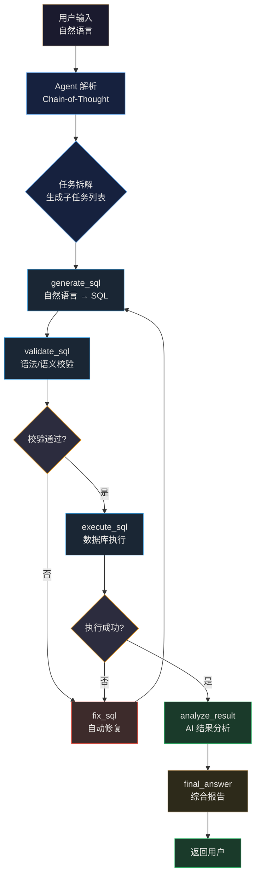

# AI SQL Agent — 工作流程可视化

## Agent Tool Calling 循环




## 8 个工具调用

```
┌─────────────────────────────────────────────────────────────────────┐
│                      🤖 SQLAgent 工具注册表                          │
├─────────────────┬───────────────────────────────────────────────────┤
│ 💻 generate_sql  │ 自然语言 → SQL 查询                              │
│ 🔍 validate_sql  │ 语法/语义校验（括号、关键字、注入检测）            │
│ 🔧 fix_sql       │ 基于错误信息自动修复 SQL                          │
│ 🗄️ execute_sql   │ 连接数据库执行查询，返回结构化结果                 │
│ 📖 explain_sql   │ 将 SQL 拆解为自然语言说明                        │
│ ⚡ optimize_sql   │ 性能分析 + 优化建议 + 索引推荐                    │
│ 📊 analyze_result │ AI 解读查询结果，发现规律和异常                   │
│ 📝 final_answer   │ 综合所有结果，生成最终报告                        │
└─────────────────┴───────────────────────────────────────────────────┘
```

## 实际执行时序（以"查询部门平均工资"为例）

```
👤 用户  ──→ "查询每个部门的平均工资，只显示大于18000的"
               │
🤖 Agent  ──→  ① CoT 推理: "需要按部门分组，计算平均工资，然后过滤 > 18000"
               │
               ├──→ ② generate_sql ─────────────────────────┐
               │     │                                        │
               │     │  LLM 生成:                              │
               │     │  SELECT d.name, AVG(e.salary)           │
               │     │  FROM employee e                        │
               │     │  JOIN department d USING(department_id) │
               │     │  GROUP BY d.name                        │
               │     │  HAVING AVG(e.salary) > 18000           │
               │     │                                        │
               │     └──→ ③ validate_sql                      │
               │           │  ✅ 括号匹配                        │
               │           │  ✅ 关键字合法                      │
               │           │  ✅ 无注入风险                      │
               │           └──→ ④ execute_sql                 │
               │                 │                             │
               │                 │  返回 3 行:                   │
               │                 │  技术部  27,000               │
               │                 │  销售部  18,500               │
               │                 │  财务部  19,000               │
               │                 └──→ ⑤ analyze_result        │
               │                       │                       │
               │                       │  "技术部平均工资最高，   │
               │                        │   达27000元..."        │
               │                       └──→ ⑥ final_answer     │
               │                             │                 │
👤 用户  ←──  📊 综合报告 ←──────────────────┘               
```

## 多模型支持架构

```
                        ┌──────────────────┐
                        │   SQLAgent        │
                        │   (统一接口)       │
                        └────────┬─────────┘
                                 │
              ┌──────────────────┼──────────────────┐
              │                  │                   │
    ┌─────────▼────────┐ ┌──────▼──────┐ ┌─────────▼────────┐
    │ OpenAI-Compatible │ │   Claude     │ │   自定义中转      │
    │ (13 providers)    │ │  (Anthropic) │ │   (Proxy)        │
    ├──────────────────┤ ├─────────────┤ ├──────────────────┤
    │ 🐱 LongCat 2.0   │ │ 🔮 Claude   │ │ 🔄 One-API       │
    │ ⚡ LongCat Flash │ │    Sonnet 4  │ │ 🔄 New-API       │
    │ 🧠 LongCat Think │ │    Opus 4    │ │ 🔄 自建中转      │
    │ 🦅 GLM-5.1       │ └─────────────┘ └──────────────────┘
    │ 🐋 DeepSeek-V4   │
    │ ☁️ Qwen3.6       │
    │ 🌙 Kimi-K2.6     │
    │ 🫘 Doubao-Seed   │
    │ 💎 Yuanbao       │
    │ 🚀 Grok          │
    │ 🧪 GPT-5.5       │
    │ 🎭 LongCat Omni  │
    │ 🍃 LongCat Lite  │
    │ 🦾 MiMo-v2.5     │
    └──────────────────┘
```

## 多数据库方言支持

```
┌────────────────────────────────────────────────────────────────┐
│                      SQL 方言适配层                             │
├──────────┬─────────────────────────────────────────────────────┤
│ 🐉 达梦   │ SYSDATE / TO_CHAR / NVL / CONCAT / LIMIT-OFFSET   │
│ 🐬 MySQL  │ NOW() / DATE_FORMAT / IFNULL / LIMIT offset,count  │
│ 🐘 PG     │ NOW() / TO_CHAR / COALESCE / LIMIT/OFFSET          │
│ 🪶 SQLite │ datetime() / strftime / IFNULL / LIMIT/OFFSET      │
└──────────┴─────────────────────────────────────────────────────┘
```
